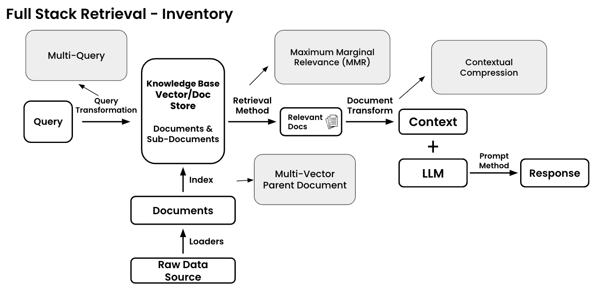

# Retrieval Inventory

Below is a list of various retrieval techniques and resources grouped by which part of the stack they influence

* [**Query Transformation**](../query-transformation/) **-** Augment, structure, or enhance your input query
  * [**Multi-Query**](../query-transformation/multi-query.md) - Generate additional questions/queries based on your original query to return more holistic documents
* [**Index**](../index/) **-** Adjust your data structures and associations
  * [**Multi-Vector**](../index/multi-vector.md) - In addition to your the normal embeddings of your documents it is sometimes helpful to have multiple _alternative_ embeddings per document. These can include embeddings of a summary, hypothetical questions, or any other custom text
  * [**Parent Document Retriever**](../index/parent-document-retriever.md) - A version of multi-vector where large chunks are further split up into smaller (child) chunks
* [**Retrieval Methods**](../retrieval-methods/) - The method in which you pull documents out of your knowledge base
  * [**Top-K Similarity Search**](../retrieval-methods/top-k-similarity-search.md) - Select the top K similar documents that match your query from your vectorestore. This is the 'Hello World' example of retrieval.
  * [**Maximum Marginal Relevance (MMR)**](../retrieval-methods/maximum-marginal-relevance-mmr.md) - Return similar but diverse documents. Great for when you'd like to remove redundancy in your context
* [**Document Transform**](../document-transforms/) - Transform your documents before using them as context with your LLM
  * [**Contextual Compression**](../document-transforms/contextual-compression.md) - Extract contextually relevant information from your retrieved docs. Generally used to try and to increase signal:noise ratio