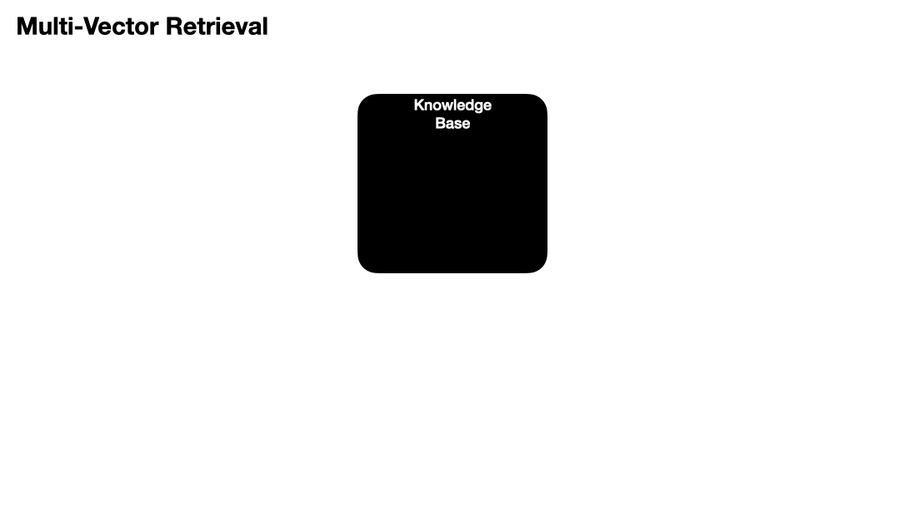

# Multi-Vector 🦜🔗
<iframe width="560" height="315" src="https://www.youtube.com/embed/6NFtydQnUio?si=c5Bs5OmgPqh_L5FE" title="YouTube video player" frameborder="0" allow="accelerometer; autoplay; clipboard-write; encrypted-media; gyroscope; picture-in-picture; web-share" allowfullscreen></iframe>

## Overview

_Multi-Vector is an advanced method of the Indexing stage of retrieval_

Often times your raw, chunked, documents may _not_ be the optimal text to get your embeddings from. It could be the case that an alternative text derived from your original documents would be better. This could include summaries, hypothetical questions, extractions, or child documents.

The goal of multi-vector retrieval is to have additional embeddings in your retrieval process which might more closely match your anticipated queries.



### Why is this helpful?

This is helpful when having a more processed or derived form of your original documents would better suit your search process. Think of this like a pre-processing step on your documents that aims to be more attuned to your search needs.

## Multi-Vector Code

First load up your keys

```python
from dotenv import load_dotenv
import os

load_dotenv()

openai_api_key=os.getenv('OPENAI_API_KEY', 'YourAPIKey')
```

Then load up your imports, there are quite a few we'll be using today

```python
from langchain.chat_models import ChatOpenAI
from langchain.schema.document import Document
from langchain.chains.summarize import load_summarize_chain
from langchain.document_loaders import WebBaseLoader
from langchain.embeddings.openai import OpenAIEmbeddings
from langchain.text_splitter import RecursiveCharacterTextSplitter
from langchain.retrievers.multi_vector import MultiVectorRetriever
from langchain.vectorstores import Chroma
from langchain.storage import InMemoryStore
import uuid
```

```
# Get your LLM and summarize chain going
llm = ChatOpenAI(temperature=0, model_name="gpt-3.5-turbo-16k")
```

```
# Loading a single website
loader = WebBaseLoader("http://www.paulgraham.com/superlinear.html")
docs = loader.load()
```

```
# Split your website into big chunks
text_splitter = RecursiveCharacterTextSplitter(chunk_size=7000, chunk_overlap=0)
chunks = text_splitter.split_documents(docs)

print (f"Your {len(docs)} documents have been split into {len(chunks)} chunks")

>> Your 1 documents have been split into 5 chunks
```

Then we will create our chain which will get the summaries for us

```
chain = load_summarize_chain(llm)
```

Then we will loop through each one of our chunks, get the summary of that chunk, and then add a unique identifier to both the summary document and the original document that tie them together

```
id_key = "doc_id" # This is the key that we will tell the retriever to connect the summaries and original docs on

summaries = [] # To hold our summaries

for chunk in chunks:
    # First let's get an ID that we'll assign to the chunk and summary. You don't need a UUID here, use whatever you want
    unique_id = str(uuid.uuid4())

    # Then let's get the summary
    chunk_summary = chain.run([chunk])
    chunk_summary_document = Document(page_content=chunk_summary, metadata={id_key: unique_id}) # Give the ID to the summary
    summaries.append(chunk_summary_document)

    # Then finnally add that same id to your chunk
    chunk.metadata[id_key] = unique_id

print (f"You have {len(summaries)} summaries to go along with your {len(chunks)} chunks")

>> You have 5 summaries to go along with your 5 chunks
```

Good, we have the same number of chunks and summaries.

Now we will set up our vectorstore (to hold the summaries and their embeddings) and docstore (to hold the original plain text chunks).

```
# The vectorstore to use to index the summary chunks
vectorstore = Chroma(collection_name="summaries", embedding_function=OpenAIEmbeddings())

# The storage layer for the parent documents
docstore = InMemoryStore()
```

Then make our retriever. This special retriever knows which key links documents based on the `id_key` we set below

```
# The retriever (empty to start)
retriever = MultiVectorRetriever(
    vectorstore=vectorstore,
    docstore=docstore,
    id_key=id_key, # "Hey, what should we join on?"
)
```

```
# Add your summary docs (with their ids) to the vectorstore. I'm unsure why a list of a uuid is returned, might be a bug.
retriever.vectorstore.add_documents(summaries)
```

If you wanted to do regular similarity search on your summaries then you can try it out here. Just call `.similarity_search` on your vectorstore inside your retriever

```
_similar_docs = retriever.vectorstore.similarity_search("What is is the influence of organizations on equity?")
_similar_docs[0]

>> Document(page_content="The passage discusses various topics related to learning, competition, equity, and wealth accumulation. It emphasizes the importance of gradual improvements in technique rather than relying on a few exceptional individuals. It also explores the concept of superlinear returns and how it relates to effort and motivation. The passage suggests that seeking competition can be a good heuristic but is not always a reliable indicator of promising problems. It mentions the influence of organizations and institutions on outcomes and the potential conflict with the concept of equity. The passage also touches on the shift from resource capture to discovery as a means of wealth accumulation. It concludes by highlighting the conventional-minded people's dislike of inequality and their inability to understand novel ideas.", metadata={'doc_id': 'c286a994-7e3a-42df-9bf0-2de8563dc472'})
```

But you see, we don't want the summaries returned, we want the original documents that are _associated_ with the summaries.

Next, we'll map the summary unique ids to the original documents, then add those to the docstore. `.mset` takes a set of keys and values and adds them to the docstore.

First let's add those ids to the original documents as metadata. Note: This isn't critical to make the operation work, you'd only add the keys if you want to double check they match up later.

Then we'll add the original documents to the docstore along w/ their ids

```
# This will give each of your splits the ID you made earlier
retriever.docstore.mset([(x.metadata[id_key], x) for x in chunks])
```

Then we'll go run the same query and have the original document returned this time, not the summary

```
retrieved_docs = retriever.get_relevant_documents("What is is the influence of organizations on equity?")
print (retrieved_docs[0].page_content[:500])
print (retrieved_docs[0].metadata)

>> gradual improvements in technique, not the discoveries of a few
exceptionally learned people.[3]
It's not mathematically correct to describe a step function as
superlinear, but a step function starting from zero works like a
superlinear function when it describes the reward curve for effort
by a rational actor. If it starts at zero then the part before the
step is below any linearly increasing return, and the part after
the step must be above the necessary return at that point or no one
would bo
{'source': 'http://www.paulgraham.com/superlinear.html', 'title': 'Superlinear Returns', 'language': 'No language found.', 'doc_id': 'c286a994-7e3a-42df-9bf0-2de8563dc472'}
```

Notice how the 'doc\_id' in the original document returned matches the 'doc\_id' in the summary above - good to go ;)

## References

* [Full notebook with code](https://github.com/gkamradt/langchain-tutorials/blob/main/data\_generation/Advanced%20Retrieval%20With%20LangChain.ipynb)
* [LangChain Documentation](https://python.langchain.com/docs/modules/data\_connection/retrievers/multi\_vector)