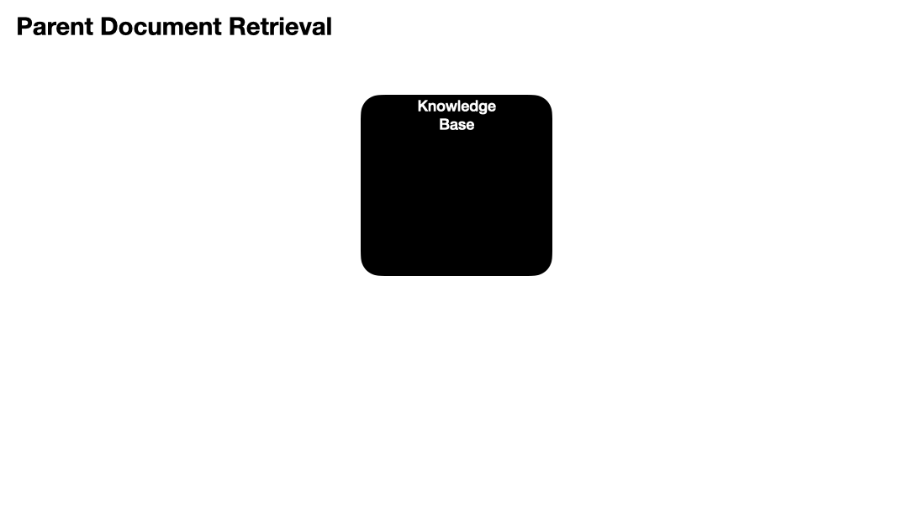

# Parent Document Retriever

<iframe width="560" height="315" src="https://www.youtube.com/embed/cmqsTJZdNSQ?si=NJyx-atmdttu74Xj" title="YouTube video player" frameborder="0" allow="accelerometer; autoplay; clipboard-write; encrypted-media; gyroscope; picture-in-picture; web-share" allowfullscreen></iframe>

## Overview

_The Parent Document retriever is a type of Multi-Vector, an advanced indexing and retrieval technique._

The Parent document retriever is a form of Multi-Vector retrieval, a class of retrieval methods by which the builder embeds _alternative_ representations of their original documents. These alternative embeddings will be then used in the similarity process to compare with the query the user or application gives.

In the case of the parent document retriever, the original large chunks will be further split into 'child' chunks.

Instead of returning the child chunks as context, the Parent Document Retriever will return the parents documents (red boxes below) of those child docs (blue boxes below).



### Why is this helpful?

There are two main reasons this method would be helpful

* **Better Embedding Similarity** - If your parent documents have multiple semantic topics held within them, a single vector may not be optimial to do similarity matching on. However, if you chunk and segment your topics further, you may be able to increase similarity matching performance.
* **Surrounding context** - You may want to use your child documents as context for your final prompt, but the context that physical surrounds your child docs would be helpful to have as well.

## Parent Document Retriever Code

First let's load up our packages

```python
from langchain.document_loaders import DirectoryLoader
from langchain.embeddings.openai import OpenAIEmbeddings
from langchain.text_splitter import RecursiveCharacterTextSplitter
from langchain.vectorstores import Chroma
from langchain.retrievers import ParentDocumentRetriever
from langchain.storage import InMemoryStore
from langchain.document_loaders import WebBaseLoader
from langchain.prompts import PromptTemplate
from langchain.chat_models import ChatOpenAI

chat = ChatOpenAI(temperature=0, model='gpt-4')
```

Then let's go grab some data. We'll use a single Paul Graham essay for this one

```python
# Loading a single website
loader = WebBaseLoader("http://www.paulgraham.com/superlinear.html")
paul_graham_essay = loader.load()
print (f"You have {len(paul_graham_essay)} document with length {len(paul_graham_essay[0].page_content)} characters or roughly {len(paul_graham_essay[0].page_content) / 4} tokens")
```

Then we need to define our parent and child splitters. These will be the text splitters that chunk up or create subsets of our documents. The only difference between the parent and child splitters are their text sizes.

```python
# Split your website into big chunks
parent_splitter = RecursiveCharacterTextSplitter(chunk_size=1000 * 4, chunk_overlap=0)

# This text splitter is used to create the child documents. They should be small chunk size.
child_splitter = RecursiveCharacterTextSplitter(chunk_size=125*4)
```

Then let's create our vectore store which will hold our child chunks along w/ their embeddings

```python
# The vectorstore to use to index the child chunks
vectorstore = Chroma(
    collection_name="parent_document_splits",
    embedding_function=OpenAIEmbeddings()
)
```

and our doc store which will hold our parent chunks (no embeddings)

```python
# The storage layer for the parent documents
docstore = InMemoryStore()
```

Then let's set up the retriever which will do most of the dirty work for us

```python
retriever = ParentDocumentRetriever(
    vectorstore=vectorstore, 
    docstore=docstore,
    child_splitter=child_splitter,
    parent_splitter=parent_splitter
)
```

Now we'll add our documents, but it's worth taking a second to appreciate all the small things which happen in the background

1. We'll add a large document
2. It will be split into large chunks (check out the code for that [here](https://github.com/langchain-ai/langchain/blob/f04cc4b7e173bd709abc9ef10686d6304e157ee5/libs/langchain/langchain/retrievers/parent\_document\_retriever.py#L88))
3. Those chunks will get an `id` assigned to them
4. Those chunks will be further split into small chunks and the `id` from the parent the chunks were split from will be assigned to the child docs

That's a lot!

```python
retriever.add_documents(paul_graham_essay)
```

Let's see how many docs we have

```python
num_parent_docs = len(retriever.docstore.store.items())
num_child_docs = len(set(retriever.vectorstore.get()['documents']))

print (f"You have {num_parent_docs} parent docs and {num_child_docs} child docs")

>> You have 8 parent docs and 82 child docs
```

Now if we query our _vectorstore_ which holds our child docs, we'll get those back

```python
child_docs = retriever.vectorstore.similarity_search("what is some investing advice?")

print (f"{len(child_docs)} child docs were found") 
child_docs[0]

>> 4 child docs were found

Document(page_content="bring you to one of the frontiers of knowledge. These look smooth\nfrom a distance, but up close they're full of gaps. Notice and\nexplore such gaps, and if you're lucky one will expand into a whole\nnew field. Take as much risk as you can afford; if you're not failing\noccasionally you're probably being too conservative. Seek out the\nbest colleagues. Develop good taste and learn from the best examples.\nBe honest, especially with yourself. Exercise and eat and sleep", metadata={'doc_id': 'adc4fef6-b5f8-4a54-a868-2757e3755482', 'language': 'No language found.', 'source': 'http://www.paulgraham.com/superlinear.html', 'title': 'Superlinear Returns'})
```

Notice the `doc_id` on that child doc? That will correspond to a parent document. Let's go find that parent document to double check. I'll just get the first part of the page\_content to save space

```python
retriever.docstore.store.get(child_docs[0].metadata['doc_id']).page_content[:500]

>> "than one in the returns for performance.Without the damping effect of institutions, there will be more\nvariation in outcomes. Which doesn't imply everyone will be better\noff: people who do well will do even better, but those who do badly\nwill do worse. That's an important point to bear in mind. Exposing\noneself to superlinear returns is not for everyone. Most people\nwill be better off as part of the pool. So who should shoot for\nsuperlinear returns? Ambitious people of two types: those who know\n"
```

Nice! There it is

Now let's go do the proper Parent Document retrieval and ask the retriever (not the vectorstore) for similar docs. This will return the parent documents back to us

```python
retrieved_docs = retriever.get_relevant_documents("what is some investing advice?")

print (f"{len(retrieved_docs)} retrieved docs were found")

>> 2 retrieved docs were found
```

I'm going to only do the first doc to save space, but there are more waiting for you. Keep in mind that LangChain will do the union of docs, so if you have two child docs from the same parent doc, you'll only return the parent doc once, not twice.

However here we got the full document back. Sometimes this will be too long and we actually just want to get a larger chunk instead. Let's do that.

Notice the chunk size difference between the parent splitter and child splitter.

Now, let's do the full process, we'll see what small chunks are generated, but then return the larger chunks as our relevant documents

```python
prompt_template = """Use the following pieces of context to answer the question at the end.
If you don't know the answer, just say that you don't know, don't try to make up an answer.

{context}

Question: {question}
Answer:"""
PROMPT = PromptTemplate(
    template=prompt_template, input_variables=["context", "question"]
)

question = "what is some investing advice?"

chat.predict(text=PROMPT.format_prompt(
    context=retrieved_docs,
    question=question
).text)

>> "The document suggests that in investing, it's only useful to believe that a company will do well if most other investors don't. If everyone else thinks the company will do well, then its stock price will already reflect that, and there's no room to make money. It also suggests taking as much risk as you can afford; if you're not failing occasionally you're probably being too conservative."
```

Awesome! We have our answer

## References

* [Full notebook with code](https://github.com/gkamradt/langchain-tutorials/blob/main/data\_generation/Advanced%20Retrieval%20With%20LangChain.ipynb)
* [LangChain Documentation](https://python.langchain.com/docs/modules/data\_connection/retrievers/parent\_document\_retriever)