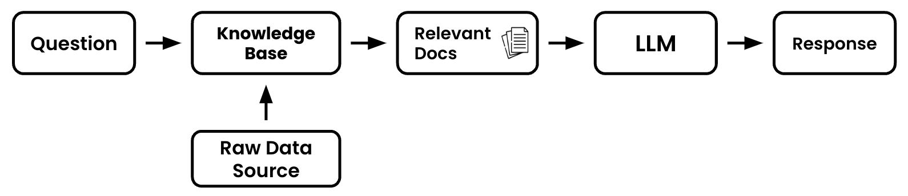
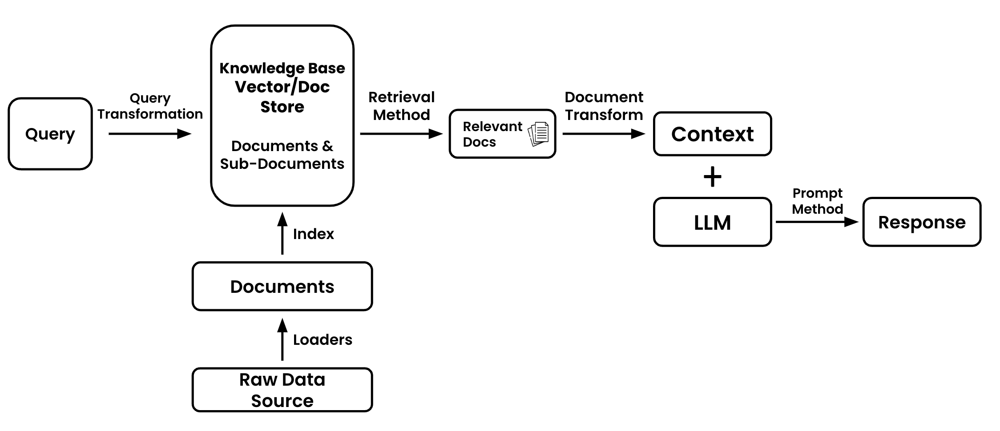

# Retrieval Overview

<iframe width="560" height="315" src="https://www.youtube.com/embed/GAikUT4OHCo?si=VeMSAlEAnne1WiYn" title="YouTube video player" frameborder="0" allow="accelerometer; autoplay; clipboard-write; encrypted-media; gyroscope; picture-in-picture; web-share" allowfullscreen></iframe>

## Retrieval From Scratch

Why do we need to worry about retrieval? Short answer: help our applications keep focus

You see, when building LLM powered applications we need to be mindful about what text we pass to our models.

Two things are true about models:

* They _don't_ have unlimited context windows. Give your model too much text, you'll get an error
* They get distracted by frivolous information. Your model will not always find the 'needle in the haystack' you're looking for

Therefore, **you need to be picky** about what text you give to your model

Your aim should be to give your model as much information as it needs to complete your task and nothing more.

Check out what [Anton](https://www.linkedin.com/in/antontroynikov/), founder @ Chroma has to say about it.

<iframe width="560" height="315" src="https://www.youtube.com/embed/fDmQnB8Ga6g?si=KJaUCgBaLKjOw82h&amp;start=1275" title="YouTube video player" frameborder="0" allow="accelerometer; autoplay; clipboard-write; encrypted-media; gyroscope; picture-in-picture; web-share" allowfullscreen></iframe>

So then, we know we need to be selective about which data we give to our model, but what does this actually look like in practice?

Let's build a framework, from the basics to full form

## Retrieval Basics

Let's start with the basics of retrieval. I've bet you've done this already without knowing it.

Have you ever taken an article, piece of code, image or email and given it to ChatGPT? Congratulations, you just did manual retrieval.

Let's say you got a long email from your boss and you need help summarizing it.

You went to Gmail, got the email you cared about, gave it to the language model, and asked it to summarize it for you.

But you can't copy and paste data forever. Especially if you're building an application that has 100s or 1000s of users. At that point you'll need a more automated solution.

## Retrieval Components

Now we start to get a more full picture of retrieval.

Let's examine a typical "Question & Answer" application.

These are common applications that builders will develop when first learning about language model applications. It's a typical, "[Hello World](https://www.youtube.com/watch?v=h0DHDp1FbmQ)" example if you will.

Let's assume that we are going to build an application which will help us answer a specific question whose answer lies within one of Paul Graham's essays.

It would be nice if we could pass his entire collection of essays ([218 of them!](http://www.paulgraham.com/articles.html)) to the model, but is too much text. We'll need to only pass the part of his essays which have the specific information the language models needs to answer the question.

Let's review retrieval process that will help us do that:

1. **Question** - This will be the piece of text that you'd like the language model to help reason about or answer.
2. **Raw Data Source -** This will be the entire collection of Paul Graham's essays on his website in their raw form (raw text).
3. **Knowledge Base** - This is where the raw data will be prepped and ready to be processed by our retrieval application.
4. **Relevant Docs** - These are the subset of the documents in your full knowledge base that your retrieval application deems helpful to answer your question. They will often be called _relevant_ or _similar_ docs. The most common way to pick which docs are helpful is see which are most _semantically similar_ to your question. That is a fancy way of saying, their meaning is similar even if the keywords aren't.

Ok, pretty simple right? Well, not so fast. Though this architecture may work for introductory applications, there are a number of situations that could make things more complicated

* What if your user gives a bad question?
* What if you have images to process?
* What if you have tables within your PDF which need parsing and analyzing?
* What if doing basic similarity scores on raw documents isn't working?

Those questions lead us to our final landing spot.

## Retrieval Nuts & Bolts

The diagram below will be the basis for this guide. It will provide us the visual landmarks to talk about which parts of our application need improvement or tuning.

Let's breakdown the entire diagram

1. **Query** - The initial piece of data that will guide the retrieval process. This can be a user question, chat history, image, audio, prompt, table, or other various data.
2. **Query Transformation** - The process of modifying or reformatting the original query to make it more suitable for retrieval. It is not required to transform your query.
3. **Raw Data Source** - The home and original collection of information. Unprocessed and unstructured from which you'll extract. This could be websites, images, picture, other applications, you name it. There may be multiple data sources.
4. **Document Loaders** - Tools or functions that extract data from a raw source
5. **Documents** - Individual units of data or information that have been extracted and are ready for indexing. This might be individual pieces of texts, single customer records, etc.
6. **Index** - A data structure that organizes data or information from your documents that makes retrieval faster, more efficient, or better performing.
7. **Knowledge Base** - A structured repository that contains indexed documents from which the retrieval process extracts documents from. This is often the combination of a vector store and document store.
8. **Retrieval Method** - The technique or algorithm used to search for an extract the most relevant documents from the knowledge base in response to a query
9. **Relevant Docs** - The subset of documents that the retrieval method determines to be most useful in addressing the query
10. **Document Transform** - The process of further refining or reformatting the relevant documents to make them more suitable for the language model. This could include summarization, compression (removing information) or other transformations.
11. **Context** - The combined content derived from the transformed documents that provide the necessary background or information for the language model to generate its response.
12. **Large Language Model (LLM)** - The machine learning model that will generate a response based on the context and prompt it's given
13. **Prompting Method** (coming soon) - The technique or method used to present the context to the language model. This also includes chaining different prompts together.
14. **Response** - The final answer or output generated by the language model based on the context and prompting method.

You'll notice that many of the sections above are linked to sections of this guide. Each section will break down alternative methods explore in the quest to squeeze our more performance from your applications.

As with most diagrams, there will be exceptions to this diagram. We'll call those out as we get to them, but for now we should be stable.